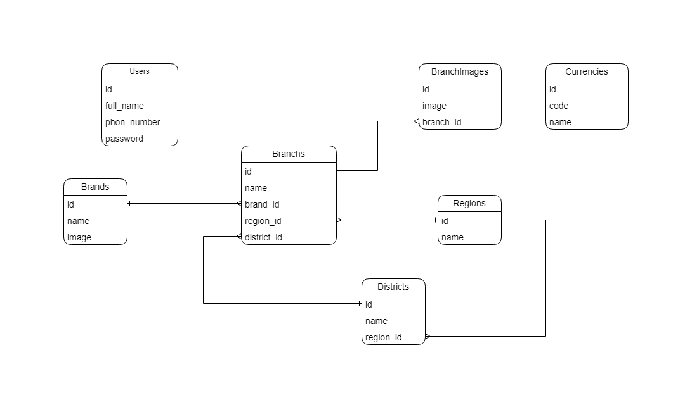

# Laravel task

### [API documentation in Postman](https://documenter.getpostman.com/view/22425394/2sA3BoarPB) 

### Tech & Tools
    

### Database schema

## Initial Setup

### 1. Clone the repository

`git clone https://github.com/rahmonov-otabek/task_laravel.git`

### 2. cd into the project 

`cd task_laravel`

### 3. Install composer dependencies 

`composer install`

### 4. Install NPM dependencies 

`npm install`

### 5. Copy the .env file 

`cp .env.example .env`

### 6. Generate an app encryption key 

`php artisan key:generate`

### 7. Create an empty database for the application
Create an empty database for your project using the database tools you prefer (phpmyadmin, datagrip, or any other mysql client).

### 8. In the .env file, add database information to allow Laravel to connect to the database
You will want to allow Laravel to connect to the database that you just created in the previous step. To do this, you must add the connection credentials in the .env file and Laravel will handle the connection from there.

In the .env file fill in the **DB_HOST**, **DB_PORT**, **DB_DATABASE**, **DB_USERNAME**, and **DB_PASSWORD** options to match the credentials of the database you just created. This will allow you to run migrations in the next step. 

### 9. Migrate the database and seeding data
Once your credentials are in the .env file, now you can migrate your database. This will create all the necessary tables in your database.

`php artisan migrate`

`php artisan db:seed`

### 10. Run for Checking Users

`php artisan schedule:work`

### 11. Local development server
To run a local development server you may run the following command. This will start a development server at **http://localhost:8000**.

`php artisan serve`